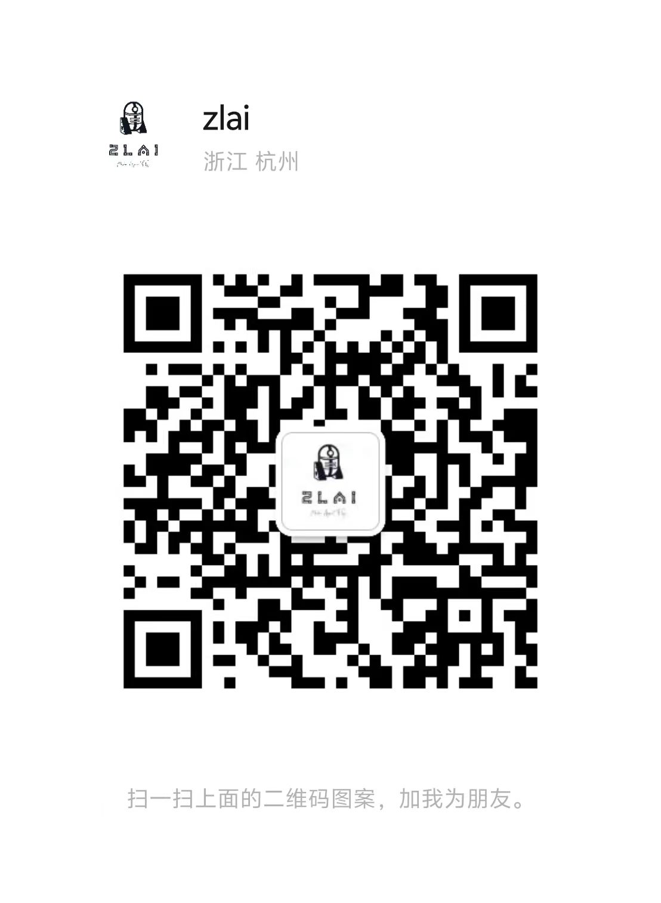

# Elasticsearch-Notebook

> Elasticsearch 笔记本，记录学习 Elasticsearch 的过程，包括官方文档、博客、书籍、视频等资源。

> 我的其他项目

- [ZLAI](https://zlai-llm.github.io/zlai-doc/#/): 大模型学习指南，丰富的RAG与Agent工具链路，面向实践的大模型学习指南。
- [KIVI](https://kivi-risk.github.io/kivi-doc/#/): 金融风控，包含信贷数据、信贷建模、信贷工具集等内容。

> Wechat

<h5>微信</h5>

